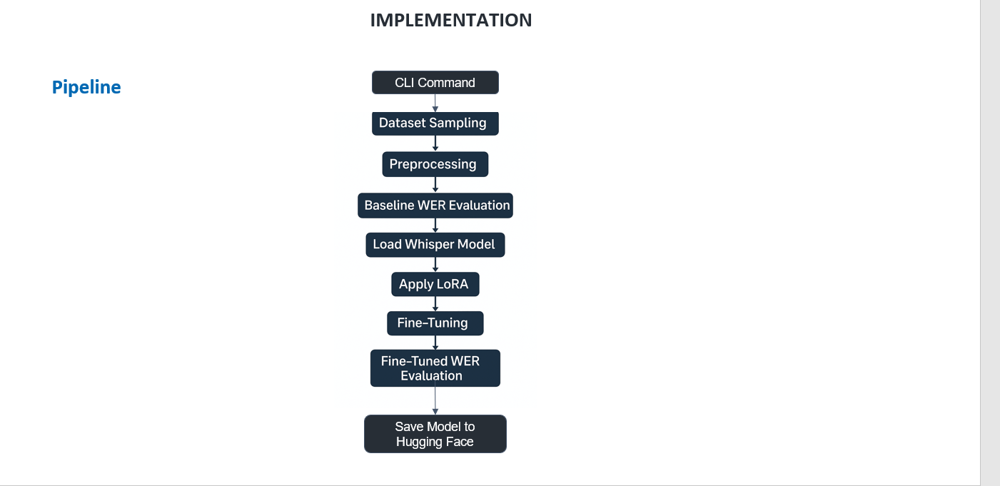

# 🔊 Breaking Language Barriers: Fine-Tuning Whisper for Bengali and Telugu ASR

Automatic speech recognition (ASR) has seen tremendous progress — but mostly for high-resource languages. This project bridges that gap by fine-tuning **OpenAI's Whisper Small** model for two low-resource Indian languages — **Bengali** and **Telugu** — using parameter-efficient fine-tuning (PEFT) methods: **LoRA**, **BitFit**, **Adapter Layers**, and **LoRA + SpecAugment**.



> Full report and presentation are available in the [report](./report) folder.

---

### Otto-von-Guericke-Universität Magdeburg, Germany

| Team Members |
|---|
| Veera Bathula |
| Ishmita Basu |
| Imon Kalyan Ghosh |

| Supervisors |
|---|
| Dr. Marco Polignano |
| Prof. Dr.-Ing. Ernesto William De Luca |

---

## 🧠 Core Libraries & Technologies

| Library | Purpose |
|---|---|
| `openai/whisper` | Pretrained multilingual ASR model |
| `transformers` | Model interface & tokenization (Hugging Face) |
| `datasets` | Data loading and preprocessing (Hugging Face) |
| `peft` | Parameter-efficient fine-tuning (LoRA, BitFit, Adapters) |
| `torchaudio` | Audio loading, processing, and spectrogram extraction |
| `pytorch` | Core deep learning framework for training |
| `accelerate` | Multi-GPU and mixed-precision training |
| `tensorboard` | Real-time training and evaluation tracking |

---

## 📌 Project Highlights

- 🔁 Fine-tunes **Whisper Small** using **LoRA**, **BitFit**, **Adapter Layers**, and **LoRA + SpecAugment**
- 📈 Evaluates **Word Error Rate (WER)** reductions on Bengali & Telugu ASR tasks
- 🧪 Combines **SpecAugment** with LoRA for improved generalization in low-resource settings
- 🛠️ Includes a **CLI pipeline** for end-to-end dataset loading, training, and evaluation
- 📤 Pushes fine-tuned models to **Hugging Face Hub** automatically
- 🧩 Designed to be **modular**, **extensible**, and **reproducible** across languages

---

## 📂 Repository Structure

```
whisper-fine-tune-low-resource-languages/
│
├── Bengali_Lora.ipynb                        # Bengali fine-tuning with LoRA
├── Bengali_LoRA_Specaugment.ipynb            # Bengali fine-tuning with LoRA + SpecAugment
├── Bengali_Bitfit.ipynb                      # Bengali fine-tuning with BitFit
├── Bengali_Adaptor_Layers.ipynb              # Bengali fine-tuning with Adapter Layers
│
├── Telugu_LoRA.ipynb                         # Telugu fine-tuning with LoRA
├── Telugu_Lora_Spec.ipynb                    # Telugu fine-tuning with LoRA + SpecAugment
├── Telugu_BitFit.ipynb                       # Telugu fine-tuning with BitFit
├── Telugu_Adaptor_Layers.ipynb               # Telugu fine-tuning with Adapter Layers
│
├── dataset_preparation.ipynb                 # Dataset loading, filtering, and preprocessing
├── prediction_demo.ipynb                     # Inference demo with fine-tuned model
├── speech_diarization-bengali.ipynb          # Speaker diarization experiment (Bengali)
│
├── lora_finetuning_pipeline.py               # CLI pipeline for LoRA-based fine-tuning
├── lora_finetuning_pipeline_demo.py          # Demo version of the CLI pipeline
│
├── visualization_loss.ipynb                  # Training vs evaluation loss plots
├── visualization_efficiency.ipynb            # Runtime and throughput analysis
├── visualization_grad_norm_training_instability.ipynb  # Gradient norm analysis
│
├── lora-tensorboard/                         # TensorBoard logs – LoRA
├── lora-specaugment-tensorboard/             # TensorBoard logs – LoRA + SpecAugment
├── bitfit-tensorboard/                       # TensorBoard logs – BitFit
├── adapter-layers-tensorboard/               # TensorBoard logs – Adapter Layers
│
├── lora_trained_model_final/                 # Saved LoRA fine-tuned model weights
├── lora_specaugment_trained_model_final/     # Saved LoRA + SpecAugment model weights
│
├── loss_data/                                # Exported loss CSV data
├── efficiency_data/                          # Runtime and throughput CSV data
├── gradient_norm_data/                       # Gradient norm CSV data
│
├── bengali-convo-1.wav                       # Sample Bengali audio for demo
├── bengali-convo-2.wav                       # Sample Bengali audio for demo
│
└── report/                                   # Full paper (PDF) and presentation (PPTX)
```

---

## 📊 Dataset Preparation

Datasets for Bengali and Telugu were sourced from [Hugging Face](https://huggingface.co/datasets). To simulate a realistic low-resource setting:

- **Bengali**: ~8,000 training samples, ~2,000 test samples (5% / 20% of full dataset)
- **Telugu**: ~4,000 training samples, ~500 test samples

All audio was validated at **16 kHz** sampling rate. Transcripts were normalised (lowercased, special characters removed), and clips exceeding 448 tokens were discarded. See [`dataset_preparation.ipynb`](./dataset_preparation.ipynb) for the full preprocessing pipeline.

---

## ⚙️ Fine-Tuning Methods

| Method | Trainable Params | Trainable Ratio |
|---|---|---|
| LoRA | 7,077,888 | 2.84% |
| LoRA + SpecAugment | 7,077,888 | 2.84% |
| Adapter Layers | 2,379,264 | 0.98% |
| BitFit | 224,256 | 0.09% |

- **LoRA** — Injects low-rank trainable matrices into attention projection layers (`q_proj`, `k_proj`, `v_proj`, `out_proj`) with rank `r=32`, scaling `α=64`, and dropout `0.05`.
- **LoRA + SpecAugment** — Combines LoRA with frequency and time masking on log-Mel spectrograms to reduce overfitting on limited data.
- **BitFit** — Restricts training to bias terms only (`<0.1%` of parameters), offering extreme efficiency at the cost of expressiveness.
- **Adapter Layers** — Inserts lightweight bottleneck modules (down-project → GELU → up-project, dim=64) into every encoder and decoder block, with residual connections.

---

## 📈 Results

| Language | Method | WER (Before → After) |
|---|---|---|
| Bengali | LoRA | 192.836 → **96.533** |
| Bengali | LoRA + SpecAugment | 192.836 → **95.629** |
| Bengali | BitFit | 192.836 → 162.960 |
| Bengali | Adapter Layers | 192.836 → 100.000 |
| Telugu | LoRA | 196.254 → **96.581** |
| Telugu | LoRA + SpecAugment | 196.254 → **96.581** |
| Telugu | BitFit | 196.254 → 192.330 |
| Telugu | Adapter Layers | 196.254 → 100.000 |

**LoRA** consistently achieved the best trade-off between WER reduction, training stability, and computational efficiency. SpecAugment provided an additional marginal improvement for Bengali, where the larger training set benefited from the augmentation-induced data diversity.

---

## 🏋️ Training

Each fine-tuning configuration was trained for **2 epochs** using the following hyperparameters:

| Hyperparameter | Value |
|---|---|
| Batch size (train/eval) | 2 |
| Gradient accumulation steps | 2 (effective batch size 4) |
| Learning rate | 1e-5 |
| Warmup steps | 50 |
| Optimizer | AdamW (weight decay 0.01) |
| Mixed precision | FP16 |
| Max gradient norm | 1.0 |

**Bengali notebooks:**
- [`Bengali_Lora.ipynb`](./Bengali_Lora.ipynb)
- [`Bengali_LoRA_Specaugment.ipynb`](./Bengali_LoRA_Specaugment.ipynb)
- [`Bengali_Bitfit.ipynb`](./Bengali_Bitfit.ipynb)
- [`Bengali_Adaptor_Layers.ipynb`](./Bengali_Adaptor_Layers.ipynb)

**Telugu notebooks:**
- [`Telugu_LoRA.ipynb`](./Telugu_LoRA.ipynb)
- [`Telugu_Lora_Spec.ipynb`](./Telugu_Lora_Spec.ipynb)
- [`Telugu_BitFit.ipynb`](./Telugu_BitFit.ipynb)
- [`Telugu_Adaptor_Layers.ipynb`](./Telugu_Adaptor_Layers.ipynb)

---

## 🛠️ CLI Fine-Tuning Pipeline

We developed an end-to-end **command-line pipeline** for LoRA-based Whisper fine-tuning. It automates dataset sampling, preprocessing, baseline WER evaluation, LoRA fine-tuning, and post-training WER reporting — all via a single command.

```bash
python lora_finetuning_pipeline.py \
  --dataset_path <hf_dataset_path> \
  --language Bengali \
  --model_size small \
  --train_split 0.05 \
  --test_split 0.20 \
  --hf_token <your_huggingface_token>
```

The pipeline also supports:
- Mixed-precision training and periodic checkpointing
- TensorBoard logging for real-time monitoring
- Automatic push of the fine-tuned model and processor to **Hugging Face Hub**

The pipeline is modular — swap the `--language` or `--dataset_path` arguments to apply it to any new language or dataset.

See [`lora_finetuning_pipeline_demo.py`](./lora_finetuning_pipeline_demo.py) for a self-contained demo version.

---

## 🔍 Inference & Demo

To transcribe audio using the fine-tuned model, use the inference demo notebook:

➡️ [`prediction_demo.ipynb`](./prediction_demo.ipynb)

Sample Bengali audio files (`bengali-convo-1.wav`, `bengali-convo-2.wav`) are included in the repository for quick testing.

---

## 🗣️ Speaker Diarization (Bonus)

An exploratory speaker diarization experiment is available for Bengali multi-speaker audio:

➡️ [`speech_diarization-bengali.ipynb`](./speech_diarization-bengali.ipynb)

This combines the fine-tuned Whisper model with speaker attribution to support multi-speaker transcription scenarios such as lectures, debates, and meetings.

---

## 📄 Report & Presentation

The full research paper and presentation slides are available in the [`report/`](./report) folder.

---

## 🔮 Future Scope

- **Dialectal adaptation** — crowdsourced datasets for Sylheti and Telangana Telugu
- **Real-time streaming transcription** — low-latency inference support
- **Cross-lingual transcription** — transcribe in one language, translate to another
- **Web UI** — Gradio or Streamlit interface for non-technical users
- **Multimodal learning** — combine audio with text or video context
